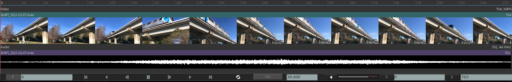

.. _interface:

###################
La interfaz de mrv2
###################

.. image:: ../images/interface-02.png
   :align: center

La ventana principal de mrv2 provee de 6 barras diferentes que pueden ser ocultadas o mostradas.

La primer barra es la de los menúes.  Puede alternarse con Shift + F1. Los menus están tambien disponibles con el Botón Derecho del Mouse en la vista principal de mrv2.  La barra de menú tiene también el botón de Edición para alternar el modo de edición y el botón de Ajustar Ventana a la Imagen.

La segunda barra es la de capas o canales, exposición, OCIO y controles de gama.  Puede ser alternada con F1.

La tercera barra es la ventana de la línea de tiempo y sus controles.  Puede alternarla con F3.

La cuarta barra es la de Información de Pixel, que muestra el pixel actual bajo el cursor.  Puede activar y desactivarla con F2.

Finalmente, la últime barra es la de Estatus.  Imprimirá errores y te dejará saber en que modo estás (Por defecto es Scrubbing).

Personalizando la Interfaz
--------------------------

.. image:: ../images/interface-03.png
   :align: center

mrv2 puede ser personalizado para mostrar cualquiera de las barras desde Ventana->Preferencias->Interfaz del Usuario.  Estos seteos son grabados cuando salis de mrv2 y te permitirán arrancar siempre mrv2 con cierta configuración.

La Línea de Tiempo
++++++++++++++++++

La Ventana Gráfica de la Línea de Tiempo permite escalar las miniaturas de Edición y las ondas de Audio arrastrando la ventana arriba y abajo.  Para una rápida vista de todas las pistas, puede cliquear en el boton de Edición en la barra de Men.
Cuando se muestran las miniaturas, puedes acercarte o alejarte con la rueda del ratón.

Ocultando/Mostrando Elementos de la GUI 
+++++++++++++++++++++++++++++++++++++++

Algunas teclas útiles por defecto:

============  =============================================
Tecla         Acción
============  =============================================
Shift + F1    Alternar la barra de Menú.
F1            Alternar la barra Superior.
F2            Alternar la barra de Pixel.
F3            Alternar la barra de Línea de Tiempo.
Shift + F7    Alternar las Herramientas de Dibujo y Acción.
F11           Alternar el modo Pantalla Completa.
F12           Alternar el modo Presentación (sin barras).
============  =============================================

Interacción del Ratón en el Visor
---------------------------------

Un ratón de tres botones es recomendado y puede ser usado para inspección de la imagen. Sosteniendo el botón del medio del ratón y moviendo el ratón para panear la imagen en la ventana gráfica. Sostenga la tecla Alt y el botón derecho del ratón y moviendo el ratón de derecha a izquierda para hacer un acercamiento o alejamiento de la imagen.  También puede usar la rueda del mouse que es más confortable.
El factor de zoom actual es mostrado en la barra de pixel a la izquierda.

.. note::
    Para 'resetear' el visor para que la imagen se ajuste a la ventana gráfica, puede seleccionar "Fit" del display de Zoom en la barra de Pixel o usar la tecla 'f'.

.. note::
    Para 'centrar' la vista, sin cambiar el factor de zoom, puede usar la tecla
    'c' hotkey.

.. note::
   Si quiere acercase o alejarse un porcentaje particular (digamos 2x), puede
   elegirlo desde el menu de zoom en la barra de Pixel.

Menu de Vista
-------------

El menú de Vista provee controles para modificar la apariencia y comportamiento del visor:

.. topic:: Safe Areas

   Alternar Áreas Seguras permite mostrar las áreas seguras de film y video.
    
.. topic:: Data Window

   Seleccionar esto mostrará o ocultará la Ventana de Datos de OpenEXR.
   
.. topic:: Display Window

   Seleccionar esto mostrará o ocultará la Ventana de Display de OpenEXR.
	   
.. topic:: Mask

   La máscara permite dibujar una máscara negra que recorta la imágen hasta darle un aspecto cinematográfico determinado.

.. topic:: HUD

   Seleccione esto para entrar a los seteos del HUD (heads up display). El HUD permite mostrar muchos metadatos de tu clip directamente en la ventana gráfica.
   

Línea de Tiempo
---------------

Indicador de Cuadro
+++++++++++++++++++

Inmediatamente a la izquierda y abajo de la línea de tiempo está el 'cuadro actual'. Junto a él esta un menu de opciones para establecer como el tiempo se muestra:
    - *Cuadros:* cuadros, empezando en 0 para películas o uno normalmente para xsecuencias.
    - *Segundos:* La posición en segundos del medio.
    - *Timecode:* el timecode de 8 digitos. Si el medio tiene metadatos de timecode estos serán usados.

Controles de Transporte
+++++++++++++++++++++++

Estos son bastante universales y no necesitan mucha explicación.
Hay un boton de Play para atrás, Pausa y Play para adelante, paso hacia delante o hacia atrás y saltar al comienzo o al final del clip.

FPS
+++

El indicador de cuadros por segundo o frames-per-second (FPS) muestra la velocidad de reproducción deseada.  El botónd de FPS es un menú que permite seleccionar rápidamente el cambio a una nueva velocidad.

Start and End Frame Indicator
+++++++++++++++++++++++++++++

A la derecha y abajo de la línea de tiempo, se muestran el cuadro de Comienzo y Final.  Los botones S and E pueden ser cliqueados para establecer el punto de Entrada y Salida en el cuadro actual.  Esto es equivalente a presionar las teclas 'I' o 'O'.

Player/Viewer Controls
++++++++++++++++++++++

Dos botones en la parte inferior de los controles de la línea de tiempo proveen las siguientes interacciones:
    - *Volumen/Control mudo:* cliquée en la bocina para alternar el control de mudo. Arrastre el deslizador a su lado para controlar el volumen.
    - *Mode de Bucle:* Estableza si la reproducción se hará una vez y dentendrá en el cuadro final, si se reproducirá en bucle o en 'ping-pong'.

Los Paneles
+++++++++++

mrv2 soporta Paneles para organizar la información lógicamente.  Estos paneles pueden ser empotrados a la derecha de la ventana gráfica o ser ventanas flotatantes si se las arrstra de su barra superior o se presiona en el pequeño botón amarillo.

Divisor
+++++++

Los Paneles tienen un divisor, tal como la Ventana Gráfica de la Línea de Tiempo, que puede ser arrastrado para hacer el panel mas grande o pequeño (y así también cambiar el tamaño de la ventana gráfica principal).

