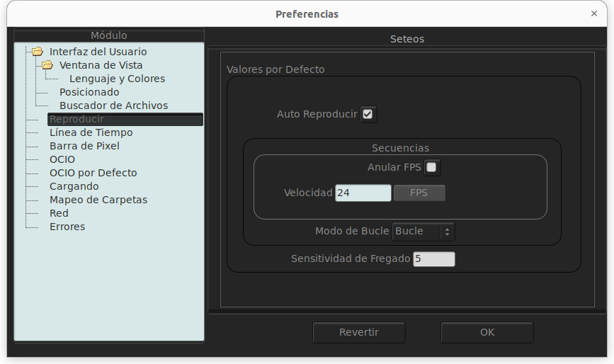
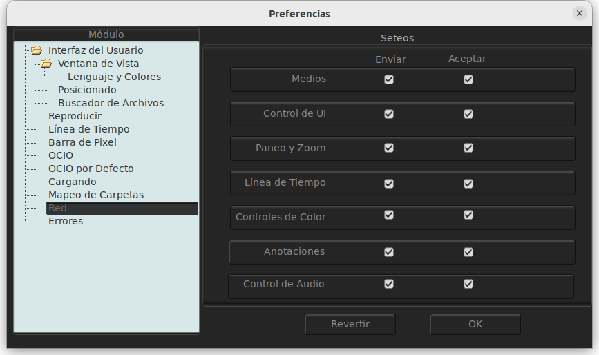

############
Preferencias
############

Las preferencias de mrv2 son modificadas llendo a **Ventana->Preferencias** (F10 por defecto). Las preferencias de mrv2 están guardadas en tu carpeta personal, dentro de la carpeta .filmaura.  Esto es:

Linux::

  /home/<usuario>/.filmaura

macOS::

  /Users/<usuario>/.filmaura

Windows::

  C:/Users/<usuario>/.filmaura

Hay varias preferencias.  El archivo principal de preferencias que tiene todos los seteos de tus ventanas, así como las preferencias de comportamiento es llamado::

  mrv2.prefs

Los seteos de mrv2.prefs para las ventanas pueden ser reseteados si arranca mrv2 con -resetSettings o va a **Panel->Settings->Default Settings**.
  
El archivo de teclas que contiene todos tus atajos es llamado::

  mrv2.keys.prefs
  
El archivo que tiene todos sus mapeos de carpetas es llamado::

  mrv2.paths.prefs

Las carpetas de favoritos del buscador de mrv2 es llamado::

  mrv2.favorites

Es importante conocer cada archivo en caso de que algo no funcione bien o quiera compartir las preferencias entre varias máquinas (puede copiar cada archivo o el directorio de .filmaura completo).

Interfaz del Usuario
====================

.. image:: ./images/preferences-01.png
   :align: center
	   
Aquí es donde puede setear las preferencias para la Interfaz del Usuario al arrancar mrv2.
La sección de Comportamiento de la Ventana permite establecer cómo se comportan la ventana principal y secundaria.

.. topic:: Siempre Arriba y Flotar Vista Secundaria

	   Este seteo establece el comportamiento de la ventanas principal y secundarias para que permanezcan siempre arriba (floten) de otras ventanas en el sistema.
	   
.. topic:: Una Instance

	   Actualmente sin uso.

.. topic:: Auto Reencuadrar la imagen

	   Cuando esta seleccionada, cualquier reescalado de la ventana reposicionará y centrará la imagen en la ventana gráfica.

.. topic:: Normal, Pantalla Completa and Presentación

	   Con este seteo, permite que mrv2 arranque al tamaño de la imagen cargada (Normal), a Pantalla Completa o en modo de Presentación.

Elementos de UI
+++++++++++++++

.. topic:: Las barras de la UI
   
	   Estas te permiten arrancar mrv2 sin alguna de sus barras.
	      
- Barra de Menú
- Barra Superior
- Barra de Pixel
- Línea de Tiempo
- Barra de Estatus

.. topic:: Menus macOS

	   Permite establecer los menus de mrv2 en la barra principal de macOS en vez de la barra de menu de mrv2 (Este seteo es para macOS solamente).

.. topic:: Tool Dock

	   Este seteo muestra o oculta las herramientas de dibujo y acción.
	      
.. topic:: Un Solo Panel

	   Cuando Está activado, sólo un panel es muestra en la section de aparcado de la interfaz principal.
		
	   
Ventana de Vista
================

.. image:: ./images/preferences-02.png
   :align: center
   
Aquí puede setear los parámetros por defecto de la ventana de vista.

.. topic:: Ganancia y Gama

           Puede establecer la ganancia y gama por defecto del visor.

.. topic:: Recorte

	   Puede setear la máscara de recorte.

.. topic:: Safe Areas

	   Puede establecer que mrv2 comience con las Áreas Seguras activadas.

.. topic:: Velocidad de Zoom

	   Esto controla cúan rápido la rueda del ratón hace zoom.

.. topic:: HUD

	   El seteo bajo este encabezado establece que parámetros se mostrarán por defecto en el HUD.

Languaje y Colores
==================

.. image:: ./images/preferences-03.png
   :align: center

Acá puede customizar los colores y el lenguaje natural usado en mrv2.

.. topic:: Lenguaje

	   Puede setear el Lenguaje Natural usado en la interfaz.

.. topic:: Esquema

	   Puede setear el esquema por defecto de FLTK.
	   Recomendamos que lo deje en gtk+.

.. topic:: Tema de Color

	   Puede establecer el esquema de color usado en la interaz.
	   Recomendamos que use Black.

.. topic:: Colores de Vista

	   Puede establecer los colores del fondo, el del rectángulo de selección, la superposición de texto (unused) y del HUD.

Posicionado
===========

.. image:: ./images/preferences-04.png
   :align: center

Aquí controla el tamaño y posición de la Ventana principal.

.. topic:: Siempre Grabe al Salir

	   Cuando está activa, la posición y tamaño de la venta de mrv2 se grabará automáticamente.

.. topic:: Posición Fija

	   Aquí puede establecer la posición en que mrv2 comenzará.

.. topic:: Tamaño Fijo

	   Con esto, puede cambiar el tamaño de la ventana al arrancar.

.. topic:: Tomar los Valores Actuales de la Ventana

	   Cuando se cliquea este botón, los valores de la Posición y Tamaño
	   Fijos serán rellenados con ls posicion y tamaño actual de la ventana
	   de mrv2.
	   
Buscador de Arhivos
===================

.. image:: ./images/preferences-05.png
   :align: center

Aquí puede establecer el comportamiento del buscador de archivo de mrv2, así como usar el buscador de archivo nativo de su sistema operativo.

.. topic:: Un Solo Click para Viajar por Carpetas

	   Activado, un click en cualquier carpeta la abrirá.  Sino, tendrá que
	   cliquear dos veces.

.. topic:: Miniaturas Activas

	   Cuando esta prendido, el buscador de mrv2 mostrará miniaturas de las imagenes, películas y activos que reconoce.

.. topic:: Vista Previa de Miniaturas de USD

	   Seleccionada, activos de USD (Pixar's Universal Scene Description) mostrarán miniaturas.  Note que si su activo USD es complejo, puede desaceleara la interfaz dramaticamente.

.. topic:: Usar el Buscador de Archivos Nativo

	   En vez de usar el buscador de archivos propio de mrv2, use el buscador de archivos nativo a su sistema operativo.

.. note::

Algunas versiones viejas de macOS no permitirían abrir directorios privados como Descargas, Documentos y Escritorio a menos que el Buscador de Archivos Nativo sea usado.
	   
Reproducir
==========

.. topic:: Auto Reproducir

	   Con este seteo, mrv2 comenzará a reproducir la película o secuencia tan pronto como se cargue.
	   
.. topic:: FPS (Frames per Second o Cuadros por Segundo)

	   Puede controlar aquí los cuadros por segundo de las secuencias de archivos que no tienen tal seteo guardado en la imagen.

.. topic:: Modo de Bucle

	   Modo de bucle por defecto.

.. topic:: Sensitividad de Fregado

	   Cúan rápido o lento arrastrar con el botón izquierdo del
	   ratón the mouse funciona cuando este fregando. 
	   
Línea de Tiempo
===============

.. image:: ./images/preferences-07.png
   :align: center

.. topic:: Display

	   Mostrar el tiempo como Cuadros, Segundos o Timecode.

.. topic:: Vista Previa de Miniaturas

	   Miniaturas sobre la línea de tiempo cuando se mueve o arrastra el ratón.  No funciona en Wayland.

Ventana de Edición
------------------

.. topic:: Comenzar en Modo de Edición

	   Selccionada, la interfaz comenzará en modo de Edición por defecto.

.. topic:: Vista Previa de Miniaturas

	   El tamaño de las miniaturas o Ninguno sin miniaturas.

.. topic:: Mostrar Transiciones

	   Si las Transiciones se muestran como una barra en modo de Edición.

.. topic:: Mostrar Marcadores

	   Mostrar Marcadores como una barra en el modo de Edición.

	   
Barra de Pixel
==============

.. image:: ./images/preferences-08.png
   :align: center

Las preferencias en esta sección permiten controlar cómo se muestran los valores de pixel en la barra de pixel.

.. topic:: Display RGBA

	   Mostrar Valores como Coma Flotante, Hex o Decimal.

.. topic:: Valores de Pixel

	   Mostrar los Valores de Pixel como Lut, Gama y Ganancia o
	   con los valores originales grabados en la película o imagen sin
	   procesarlos a través de las transformaciones de color del visor.

.. topic:: Display Secundario

	   Establece como mostrar los valores de display secundario:

	   - HSV
	   - HSL
	   - CIE XYZ
	   - CIE xyY
	   - Lab CIELAB
	   - Luv CIELUV
	   - YUV (Analog PAL)
	   - YDbDr (Analog SECAM / PAL-N)
	   - YIQ (Analog NTSC)
	   - ITU-601 (Digital PAL/NTSC YCbCr)
	   - ITU-709 (Digital HDTV YCbCr)

.. topic:: Luminancia

	   Mostrar la Luminancia como:

	   - Luminance (Y)
	   - Lumma (Y')
	   - Lightness
	     
OCIO
====

.. image:: ./images/preferences-09.png
   :align: center

	   
.. topic:: Archivo Config de OCIO

	   Seteo de Configuración de OCIO.

.. note::

   Si está seteada la variable de entorno OCIO, este seteo será ignorado.
	   
OCIO por Defecto
================

.. image:: ./images/preferences-10.png
   :align: center

.. topic:: Use Vistas Activas y Displays Activos
	   
	   Al estar seleccionada, si el archivo de OCIO config.ocio tiene vistas o displays activos, éstos serán usados (filtrados).  De otra forma, serán ignorados.

.. topic:: Espacio de Entrada de Color

	   Establece el Espacio de Entrada de Color para cada imagen basada en
	   su profundidad de bits.
	   
Cargando
========

.. image:: ./images/preferences-11.png
   :align: center

Controlas el comportamiento de cargar películas e imágenes.

.. topic:: Cuadro Faltante

	   Setea que hacer cuando una secuencia o archivo .otio está faltante un cuadro.
	   Puede ponerlo a Cuadro Negro, Repetir Cuadro (el último disponible)
	   or Repetir Cuadro Marcado (el último disponible pero marcado con una
	   cruz roja).
	   
.. note::
   Un seteo diferente que Cuadro Negro puede hacer que el fregado sea lento si hay muchos cuadros faltantes.

.. topic:: Regex de Versión

	   mrv2 supporta versionamiento de imágenes y películas usando una expresión regular (regex).  Por defecto se usa _v que empatará cualquier texto que comience con _v y un número.  Cuando una versión se localiza y un Siguiente, Previo, Primera o Última version es buscada, el chequeo de la regex es impresa a la terminal.

.. topic:: Máximas Imágenes Aparte

	   Al buscar un versiond de imagen previa o siguiente, este seteo controla cuan lejos buscarla en el disco y cuan lejos los números de versión pueden estar.
	   
Mapeo de Carpetas
=================

.. image:: ./images/preferences-12.png
   :align: center

Mapeo de Carpetas te permite compartir imágenes y películas en la red incluso cuando el disco y las carpetas no sean iguales.  En el ejemplo de arriba, el Directorio Remoto es /Users/gga (una carpeta macOS), que es mapeada a /home/gga (uno de Unix).

Los caminos de mapeo de carpetas son grabados en un simple archivo de texto en tu directorio de usuario de .filmaura como as mrv2.paths.prefs.

.. topic:: Agregar Carpetas

	   Permite agragar un mapeo nuevo de remoto/local.

.. topic:: Eliminar Carpetas

	   Remueve el mapeo de carpeta seleccionado.

Red
===

Las preferencias de Red permiten establecer que seteos son enviados y recibidos por la máquina local cuando está conectada en una red a otro servidor o cliente.

Errores
=======

.. image:: ./images/preferences-14.png
   :align: center

La Preferencias de  Errores permite establecer que hacer en caso de un error. Podés elegir entre Hacer Nada, Abrir Bitácora en el Muelle o Abrir Bitácora en la Ventana (por defecto).
