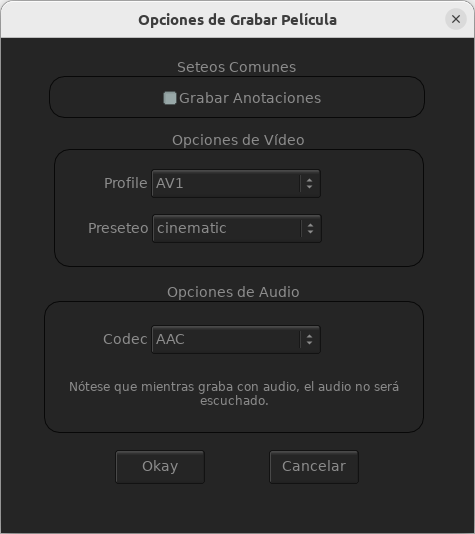

########
Grabando
########

Grabando una Película
---------------------
	   
Cuando se graba una película desde Archivo->Grabar Película o Secuencia y escribir la extensión de la película (como "test.mov") una ventana de opciones aparecerá.

	   
.. topic:: Grabar Annotaciones

	   Cuando está activa, las anotaciones en el vídeo serán grabadas.

.. topic:: Opciones de Vídeo

	   * Perfil

	     Con la opción de Perfil, puede elegir el codec básico usado al grabar la película.  Actualmente, estos pueden ser "Ninguno", "H264", "ProRes", "ProRes_Proxy", "ProRes_LT", "ProRes_HQ", "ProRes_4444" o "ProRes_XQ".
Note que el codec más compabile ("H264") requiere una licencia de VideoLAN para encodificar o que compile mrv2 en modo GPL.
Por favor referirse a las instrucciones de compilación de mrv2 en:
	      
              https:://github.com/ggarra13/mrv2

	   * Preseteo

	     Con la selección de preseteo, puede elegir la cualidad de
	     codificación del codec seleccionado.  Actualmente, incluímos
	     preseteos para vp9 y av1.
	     Puede ponerlos en $STUDIOPATH/presets or en el directorio presets
	     de la instalación de mrv2.

	     Los preseteos deben ser llamados como::
	      
	       codec-nombrepreseteo.pst

	     Por ejemplo::

	       vp9-bueno.pst

	     Estos preseteos serán listados en la opción de grabar películas
	     cuando el codec apropiado es usado.  Note que el nombre del codec
	     es en minúsculas.

	     El archivo de preseteo es uno con parametros separados por dos
	     puntos, como::

	       # This is a comment
	       deadline:good      # this is another comment
	       webm:              # flag with no parameters
	       tile-column:1      # integer flag
	       cq-level:25
	      
.. topic:: Optiones de Audio

	   * Codec

	      Con este seteo, controla el codec de audio usado al grabar un
	      vídeo con audio.
	      

Grabando una Sequencia de Imágenes
----------------------------------
	   
Cuando se graba una secuencia de imágenes del menú Archivo->Grabar Película o Secuencia y escribir la extensión de la secuencia con un número (como "prueba.0001.exr") una ventana de opciones aparecerá.

.. image:: ./images/save-images-01.png
   :align: center
	   
.. topic:: Grabar Anotaciones

	   Cuando esta activa, las anotaciones en el vídeo serán grabadas.
	   Esta opción también te permitirá grabar formatos que son
	   incompatibles con OpenEXR, como los formatos YUV formats de la
	   mayoría de películas.

.. topic:: Opciones de OpenEXR

	   * Compresión

	     Este seteo te permite elegir el tipo de compresión usado al grabar una secuencia de OpenEXR.
	      
	   * Tipo de Pixel

	     Podés seleccionar el tipo de pixel a grabar (Half, media coma flotante o Float, coma flotante completa).

	   * Compresión ZIP
	     
	     Cuando el tipo de compresión es "ZIP" or "ZIPS" este seteo te 
	     permite controlar la cantidad de compresión del mismo.

	   * Compresión DWA

	     Para compresiones DWAA y DWAB, este seteo controla la cantidad de
	     compresión en estos formatos.
