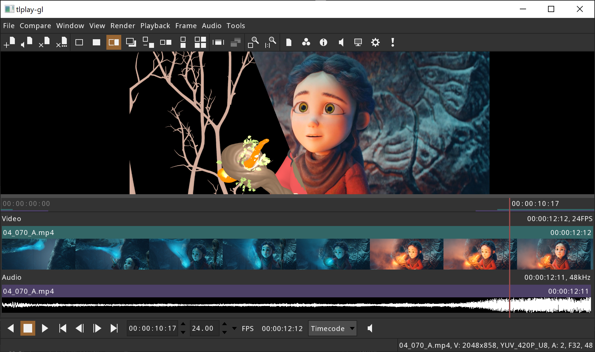

[](https://opensource.org/licenses/BSD-3-Clause)
[](https://github.com/ggarra13/tlRender/actions/workflows/ci-workflow.yml)
[](https://codecov.io/gh/ggarra13/tlRender)

tlRender
========
tlRender is an open source library for building playback and review
applications for visual effects, film, and animation.

The library can render and playback timelines with multiple video clips,
image sequences, audio clips, and transitions. Examples are provided for
integrating the library with Qt and OpenGL applications.

The library is written in C++ and uses the CMake build system.



This screenshot shows an example playback application built with the tlRender
user interface library. Two files are being compared with an A/B "wipe", a USD
animation and a rendered movie.

"Spring" content: © Blender Foundation | cloud.blender.org/spring

Currently supported:
* Movie files (.mp4, .mov, ...)
* Image file sequences (.cin, .dpx, .exr, .jpg, .png, .tiff, ...)
* Multi-channel audio
* Color management with OpenColorIO
* A/B comparison
* OpenTimelineIO .otioz file bundles

Work in progress:
* USD support

To do:
* Software rendering
* Apple Metal rendering
* Microsoft DirectX rendering
* Effects
* GPU movie decoding
* Nested timelines
* Python bindings

Contents:
* [Libraries](#Libraries)
* [Dependencies](#dependencies)
* [Building](#building)
    * [Building Dependencies](#build-dependencies)
    * [Building on Linux](#building-on-linux)
    * [Building on macOS](#building-on-macos)
    * [Building on Windows](#building-on-windows)


# Libraries

Core libraries:
* tlBaseApp - Base application
* tlCore - Core functionality; file paths and I/O, math, images, audio, etc.
* tlGL - OpenGL support
* tlIO - Video, audio, and image I/O
* tlUI - User interface
* tlUIApp - User interface application

Timeline libraries:
* tlDevice - Hardware devices
* tlTimeline - Timelines
* tlTimelineGL - Timeline OpenGL support
* tlTimelineUI - Timeline user interface

Qt integration libraries:
* tlQt - Qt support
* tlQtQuick - Qt Quick support
* tlQtWidget - Qt QWidget support

Application libraries:
* tlBakeApp - tlbake application
* tlPlay - Player application support
* tlPlayApp - tlplay application
* tlPlayQtApp - tlplay-qt application
* tlResourceApp - tlresource application


# Dependencies

Required dependencies:
* [Imath](https://github.com/AcademySoftwareFoundation/Imath)
* [nlohmann_json](https://github.com/nlohmann/json)
* [ZLIB](https://zlib.net)
* [minizip-ng](https://github.com/zlib-ng/minizip-ng)
* [OpenTimelineIO](https://github.com/PixarAnimationStudios/OpenTimelineIO)
* [FreeType](https://www.freetype.org)

Optional dependencies:
* [GLFW](https://www.glfw.org/)
* [OpenSSL](https://www.openssl.org)
* [libssh2](https://libssh2.org)
* [curl](https://curl.se/libcurl)
* [OpenColorIO](https://github.com/AcademySoftwareFoundation/OpenColorIO)
* [RtAudio](https://github.com/thestk/rtaudio)
* [libsamplerate](https://github.com/libsndfile/libsamplerate)
* [JPEG](https://libjpeg-turbo.org)
* [TIFF](http://www.libtiff.org)
* [PNG](https://libpng.sourceforge.io/index.html)
* [OpenEXR](https://www.openexr.com/)
* [FFmpeg](https://ffmpeg.org)
* [OpenUSD](https://github.com/PixarAnimationStudios/OpenUSD)
* [nativefiledialog-extended](https://github.com/btzy/nativefiledialog-extended)
* [Qt version 5 or 6](https://www.qt.io)


# Building

## Building Dependencies

A CMake super build script is provided to build all of the dependencies from
source except for Qt. Qt needs to be installed separately:
https://www.qt.io/

## Building on Linux

Clone the repository:
```
git clone https://github.com/darbyjohnston/tlRender.git
```
Run CMake with the super build script:
```
cmake -S tlRender/etc/SuperBuild -B Release -DCMAKE_INSTALL_PREFIX=$PWD/Release/install -DCMAKE_PREFIX_PATH=$PWD/Release/install -DCMAKE_BUILD_TYPE=Release
```
Start the build:
```
cmake --build Release -j 4 --config Release
```
Try running the `tlplay` application:
```
export LD_LIBRARY_PATH=$PWD/Release/install/lib:$LD_LIBRARY_PATH
```
```
./Release/tlRender/src/tlRender-build/bin/tlplay/tlplay tlRender/etc/SampleData/MultipleClips.otio
```

### Building on Linux with Qt 6

Add the Qt location to `CMAKE_PREFIX_PATH` (place double quotes around the list of paths)
and enable `TLRENDER_QT6`:
```
cmake -S tlRender/etc/SuperBuild -B Release -DCMAKE_INSTALL_PREFIX=$PWD/Release/install -DCMAKE_PREFIX_PATH="$PWD/Release/install;$HOME/Qt/6.5.3/gcc_64" -DTLRENDER_QT6=ON -DCMAKE_BUILD_TYPE=Release
```

### Building on Linux with Qt 5

Add the Qt location to `CMAKE_PREFIX_PATH` (place double quotes around the list of paths)
and enable `TLRENDER_QT5`:
```
cmake -S tlRender/etc/SuperBuild -B Release -DCMAKE_INSTALL_PREFIX=$PWD/Release/install -DCMAKE_PREFIX_PATH="$PWD/Release/install;$HOME/Qt/5.15.2/gcc_64" -DTLRENDER_QT5=ON -DCMAKE_BUILD_TYPE=Release
```

### Minimal build on Linux

Build with only the minimal required dependencies:
```
cmake -S tlRender/etc/SuperBuild -B Release -DCMAKE_INSTALL_PREFIX=$PWD/Release/install -DCMAKE_PREFIX_PATH=$PWD/Release/install -DCMAKE_BUILD_TYPE=Release -DTLRENDER_OCIO=OFF -DTLRENDER_AUDIO=OFF -DTLRENDER_JPEG=OFF -DTLRENDER_TIFF=OFF -DTLRENDER_STB=OFF -DTLRENDER_PNG=OFF -DTLRENDER_EXR=OFF -DTLRENDER_FFMPEG=OFF -DTLRENDER_PROGRAMS=OFF -DTLRENDER_EXAMPLES=OFF -DTLRENDER_TESTS=OFF
```

### Notes for building on Linux

Example for running gcovr for code coverage:
```
gcovr -r ../../../../lib --html --object-directory lib --html-details --output gcov.html lib/tlCore lib/tlIO lib/tlTimeline
```

## Building on macOS

Clone the repository:
```
git clone https://github.com/darbyjohnston/tlRender.git
```
Run CMake with the super build script:
```
cmake -S tlRender/etc/SuperBuild -B Release -DCMAKE_INSTALL_PREFIX=$PWD/Release/install -DCMAKE_PREFIX_PATH=$PWD/Release/install -DCMAKE_BUILD_TYPE=Release
```
Start the build:
```
cmake --build Release -j 4 --config Release
```
Try running the `tlplay` application:
```
./Release/tlRender/src/tlRender-build/bin/tlplay/tlplay tlRender/etc/SampleData/MultipleClips.otio
```

### Building on macOS with Qt 6

Add the Qt location to `CMAKE_PREFIX_PATH` (place double quotes around the list of paths)
and enable `TLRENDER_QT6`:
```
cmake -S tlRender/etc/SuperBuild -B Release -DCMAKE_INSTALL_PREFIX=$PWD/Release/install -DCMAKE_PREFIX_PATH="$PWD/Release/install;$HOME/Qt/6.5.3/macos" -DTLRENDER_QT6=ON -DCMAKE_BUILD_TYPE=Release
```

### Building on macOS with Qt 5

Add the Qt location to `CMAKE_PREFIX_PATH` (place double quotes around the list of paths)
and enable `TLRENDER_QT5`:
```
cmake -S tlRender/etc/SuperBuild -B Release -DCMAKE_INSTALL_PREFIX=$PWD/Release/install -DCMAKE_PREFIX_PATH="$PWD/Release/install;$HOME/Qt/5.15.2/clang_64" -DTLRENDER_QT5=ON -DCMAKE_BUILD_TYPE=Release
```

### Notes for building on macOS

The CMake variable `CMAKE_OSX_ARCHITECTURES` can be used to specify the build
architecture:
```
-DCMAKE_OSX_ARCHITECTURES=x86_64
```
```
-DCMAKE_OSX_ARCHITECTURES=arm64
```

These aliases are convenient for switching between architectures:
```
alias arm="env /usr/bin/arch -arm64 /bin/zsh --login"
alias intel="env /usr/bin/arch -x86_64 /bin/zsh --login"
```

## Building on Windows

Dependencies:
* Install MSYS2 (https://www.msys2.org) for compiling FFmpeg.
* Install Strawberry Perl (https://strawberryperl.com/) for compiling network support.
* Install Python 3.11 for compiling USD.

Clone the repository:
```
git clone https://github.com/darbyjohnston/tlRender.git
```
Run CMake with the super build script:
```
cmake -S tlRender\etc\SuperBuild -B Release -DCMAKE_INSTALL_PREFIX=%CD%\Release\install -DCMAKE_PREFIX_PATH=%CD%\Release\install -DCMAKE_BUILD_TYPE=Release
```
Start the build:
```
cmake --build Release -j 4 --config Release
```
Try running the `tlplay` application:
```
set PATH=%CD%\Release\install\bin;%PATH%
```
```
.\Release\tlRender\src\tlRender-build\bin\tlplay\Release\tlplay tlRender\etc\SampleData\MultipleClips.otio
```

### Building on Windows with Qt 6

Add the Qt location to `CMAKE_PREFIX_PATH` (place double quotes around the list of paths)
and enable `TLRENDER_QT6`:
```
cmake -S tlRender\etc\SuperBuild -B Release -DCMAKE_INSTALL_PREFIX=%CD%\Release\install -DCMAKE_PREFIX_PATH="%CD%\Release\install;C:\Qt\6.5.3\msvc2019_64" -DTLRENDER_QT6=ON -DCMAKE_BUILD_TYPE=Release
```

### Building on Windows with Qt 5

Add the Qt location to `CMAKE_PREFIX_PATH` (place double quotes around the list of paths)
and enable `TLRENDER_QT5`:
```
cmake -S tlRender\etc\SuperBuild -B Release -DCMAKE_INSTALL_PREFIX=%CD%\Release\install -DCMAKE_PREFIX_PATH="%CD%\Release\install;C:\Qt\5.15.2\msvc2019_64" -DTLRENDER_QT5=ON -DCMAKE_BUILD_TYPE=Release
```
